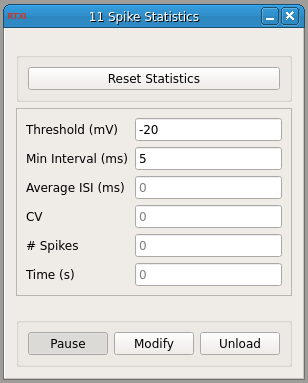

###Spike Statistics

**Requirements:** none  
**Limitations:** none  
 

This module contains a spike detector based on a positive threshold crossing (see SpikeDetect module). It computes the average ISI and the current coefficient of variation. These values are continuously updated with each spike until the statistics are reset with the button.

####Input Channels
1. input(0) - "Vm" : i.e. Membrane potential (V)

####Output Channels
1. output(0) - "ISI" : i.e. Output current (A)

####Parameters
1. threshold (mV) : Voltage threshold at which to 'detect' a spike
2. min interval (ms) : Minimum interval that must pass before another spike can be detected (i.e. refractory period)
